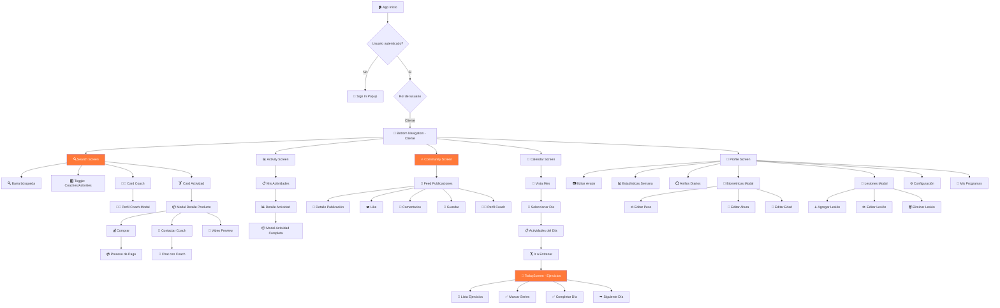
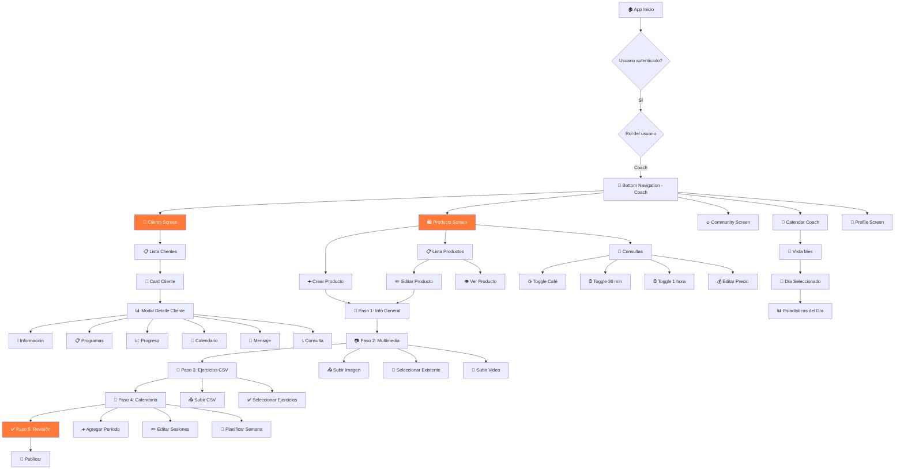
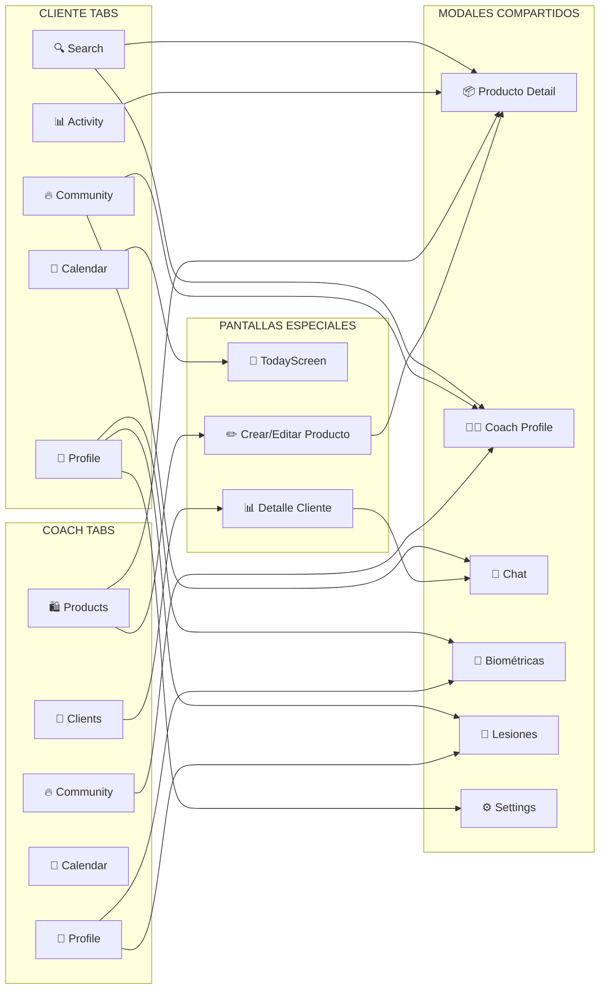

# 🔄 DIAGRAMA DE FLUJO COMPLETO - OMNIA

## 📊 MAPA DE NAVEGACIÓN INTERACTIVO

Este diagrama muestra todas las conexiones entre pantallas, modales y acciones en la aplicación OMNIA.

---

## 🎯 **FLUJO PRINCIPAL - CLIENTE**



---

## 👨‍💼 **FLUJO PRINCIPAL - COACH**



---

## 🔗 **DIAGRAMA UNIFICADO (Cliente + Coach)**



---

## 🎨 **ESPECIFICACIONES DE DISEÑO**

### **Tipografía:**
```
Headers: Inter Bold, 24-28px
Subtítulos: Inter SemiBold, 18-20px
Body: Inter Regular, 14-16px
Labels pequeños: Inter Medium, 12px
```

### **Espaciado:**
```
Padding contenedor: 20px
Spacing entre cards: 16px
Spacing interno card: 12px
Border radius cards: 12px
Border radius buttons: 8px
```

### **Sombras:**
```
Cards: 0px 2px 8px rgba(0, 0, 0, 0.1)
Modales: 0px 8px 32px rgba(0, 0, 0, 0.3)
Bottom nav: 0px -2px 8px rgba(0, 0, 0, 0.1)
```

### **Iconos:**
```
Tab icons: 24x24px
Action icons: 20x20px
Small icons: 16x16px
Lucide React icon library
```

---

## 🎯 **LISTA DE PANTALLAS PARA DISEÑAR**

### **Cliente (9 pantallas):**
1. ✅ Search Screen
2. ✅ Activity Screen (Mis actividades)
3. ✅ Community Screen (Feed)
4. ✅ Calendar Screen (Calendario)
5. ✅ Profile Screen (Perfil)
6. ✅ TodayScreen (Ejercicios del día)
7. ✅ Modal Detalle Producto
8. ✅ Modal Perfil Coach
9. ✅ Modal Biométricas/Lesiones

### **Coach (11 pantallas):**
1. ✅ Clients Screen
2. ✅ Products Screen
3. ✅ Community Screen (compartida)
4. ✅ Calendar Coach Screen
5. ✅ Profile Screen (compartida)
6. ✅ Modal Detalle Cliente
7. ✅ Modal Crear Producto - Paso 1
8. ✅ Modal Crear Producto - Paso 2
9. ✅ Modal Crear Producto - Paso 3
10. ✅ Modal Crear Producto - Paso 4
11. ✅ Modal Crear Producto - Paso 5

### **Componentes Compartidos (6):**
1. ✅ Header con Settings y Messages
2. ✅ Bottom Navigation (Cliente)
3. ✅ Bottom Navigation (Coach)
4. ✅ Card Producto/Actividad
5. ✅ Barra de Progreso
6. ✅ Button Principal

---

**Total: ~20 pantallas + 6 componentes = 26 elementos en Figma** 🎨

Este diseño completo te permitirá visualizar todo el flujo de la aplicación y entender cómo cada elemento se conecta con los demás.
