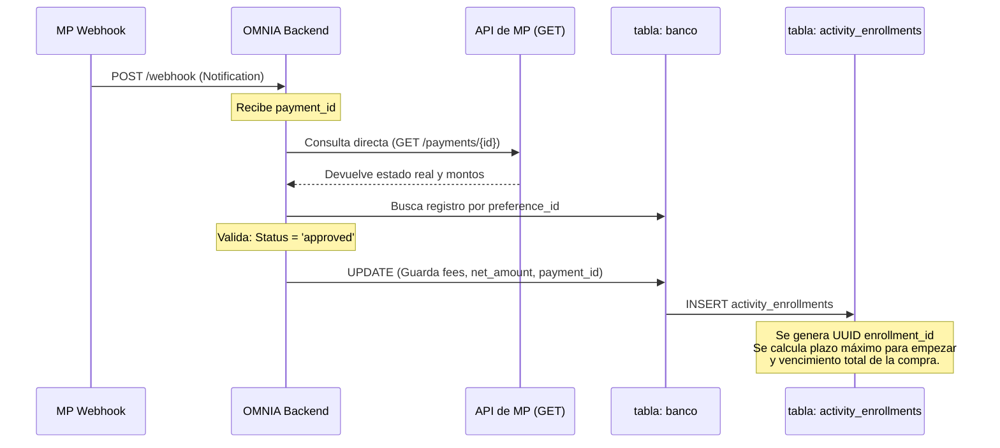
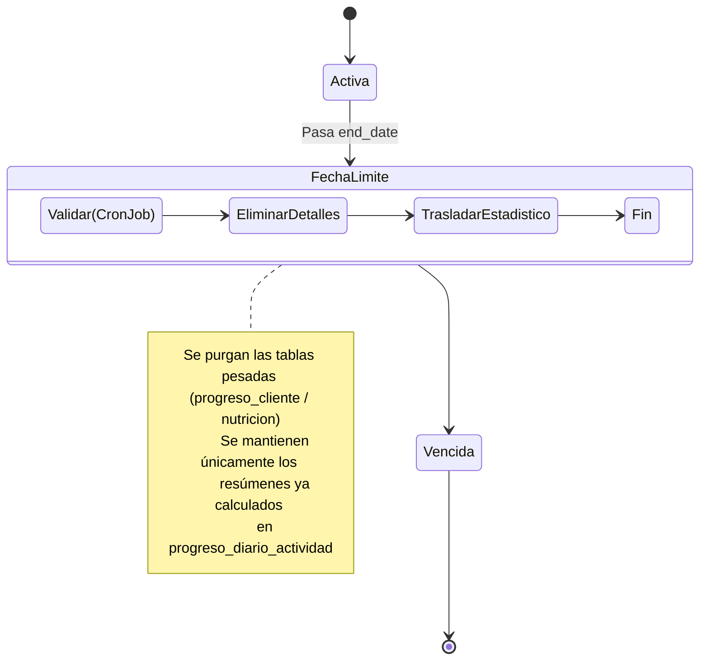

# 🏛️ OMNIA: Arquitectura Core de Compras y Progreso

Una guía visual del ciclo de vida de cada producto (Programa, Taller o Documento), desde el cobro hasta la consolidación final del progreso del cliente y su eventual vencimiento.

---

## 📍 1. El Evento Gatillo: Validación y Pago Exitoso

Todo inicia en el backend cuando la pasarela de pagos (`MercadoPago`) notifica que un pago se ha completado. Para garantizar la máxima seguridad y evitar fraudes, OMNIA realiza una verificación en dos pasos usando la tabla **`banco`**.



### 🔒 La Tabla `banco` (El Escribano Púbico)
Antes de crear el progreso, OMNIA se asegura de que la plata es real:
1.  **Doble Check:** El webhook no se fía del JSON que recibe. Usa el `payment_id` recibido para consultar _directamente_ a la API de MercadoPago usando el **Access Token** privado del sistema.
2.  **Registro Indestructible:** Se actualiza el registro en la tabla `banco` (que se había creado en estado 'pending' al generar el link de pago). 
3.  **Datos Críticos Guardados:** El sistema inserta como comprobante irrefutable: `mercadopago_payment_id`, las comisiones exactas deducidas (`marketplace_fee`, `mercadopago_fee`), el monto neto recibido (`seller_amount`) y marca el `payment_status` como 'completed'.

**La clave maestra de la Vida Útil:** Únicamente tras blindar la tabla `banco`, se crea el registro en `activity_enrollments`. Allí se guardan 3 fechas críticas que rigen toda la vida del producto para el cliente:
1.  `dias_hasta_empezar`: El máximo de días que el usuario tiene para darle a "Start" antes de que el sistema le clave la fecha inicial a la fuerza.
2.  `start_date`: Queda nula hasta que el cliente decida empezar.
3.  `end_date`: Se calcula sumando la duración en semanas/días a partir del `start_date`. Una vez cruzada esta fecha, la actividad "Vence".

---

## 📍 2. El Flujo de Motor según el Producto

Dependiendo del tipo de producto comprado, los datos navegan por tablas totalmente diferentes:

```mermaid
flowchart TD
    A[Nuevo enrollment_id creado] --> B{¿Qué tipo de producto es?}
    
    %% PROGRAMAS DE FITNESS Y NUTRICIÓN
    B -->|Programa (Fitness/Nutrición)| C[Esperar click en 'Empezar Actividad']
    C -->|Botón Presionado| D[Se setea start_date y end_date reales]
    
    D --> E[Motor Lee product_conditional_rules]
    E --> F[Filtrar y Armar Personalización]
    
    F --> G[Leer Estructura del Coach]
    G --> H[periodos]
    H --> I[planificacion_ejercicios]
    I --> J[ejercicios_detalles / nutricion]
    
    J -->|Copia exacta para el cliente| K[(progreso_cliente \n/ progreso_cliente_nutricion)]
    
    %% TALLERES
    B -->|Taller (Workshop)| L[Generar acceso a Módulos/Temario]
    L --> M[(taller_progreso_temas)]
    M -->|Coach marca asistencia o \n Cliente lee módulo| N[Actualizar status de ejecución]
    
    %% DOCUMENTOS / CITAS
    B -->|Documentos / Sesiones| O[Acceso Directo Reactivo]
    O --> P[(document_progress / citas)]
    
    %% CONVERGENCIA FINAL (EL CALENDARIO)
    K -.->|Trigger Automático Diario| Q
    N -.->|Trigger / API Check| Q
    P -.->|API Call / Evento final| Q
    
    Q[[(progreso_diario_actividad \n Resumen por Fecha y Enrollment)]]
    style Q fill:#ff7939,stroke:#333,stroke-width:2px,color:#fff
```

### 🧩 A. Ciclo de Programas (Dinámico y Predictivo)
1.  El progreso real no existe en la BD hasta que no hay `start_date`.
2.  Cuando el usuario inicia, el RPC `duplicate_program_details_on_enrollment` hace el mapeo masivo tomando en cuenta las **limitaciones físicas/condicionales** (`product_conditional_rules`).
3.  Copia las semanas (`periodos`), saca los bloques (`planificacion_ejercicios`) y baja hasta los detalles. Tira toda esa inmensa cantidad de registros diarios en las tablas **`progreso_cliente`**.
4.  **La Consolidación:** Un Trigger PostgreSQL detecta cada INSERT en `progreso_cliente` y suma calorías, minutos y objetivos. El total se envía como una única fila compacta de resumen diario a **`progreso_diario_actividad`**.

### 🧩 B. Ciclo de Talleres (Sincrónico y Asistencial)
1.  No se duplican rutinas. Se habilitan los temarios en la tabla **`taller_progreso_temas`**.
2.  Un registro cae a `progreso_diario_actividad` únicamente cuando en el día actual hay una cita de Taller marcada como Completada/Asistida.

---

## 📍 3. El Vencimiento y "Cosecha" del Progreso

Al llegar la fecha de `end_date` definida en `activity_enrollments`, la plataforma necesita liberar espacio, cerrar la historia de la compra, y convertir el detalle de cada repetición en un registro estadístico congelado para el histórico del cliente:



### 🧹 El proceso de Extracción:
1.  **Purga de Detalles:** Para no saturar la BD de los coaches, las filas pesadas de `progreso_cliente` que contienen cada serie, peso y repetición se eliminan.
2.  **La Semilla Eterna:** Lo único que sobrevive para siempre en el calendario histórico del cliente es su estadística resumida que ya vivía en **`progreso_diario_actividad`**.
3.  **El problema del Enrollment:** Si un cliente re-compra el plan de hipertrofia hoy, y `progreso_diario_actividad` usaba solo el `actividad_id`, colisionaría con la instancia vencida que dejamos guardada de muestra. Por ello el `enrollment_id` es el diferenciador que permite tener métricas únicas de "Mi intento de enero" vs "Mi intento de marzo" para el mismo producto.
