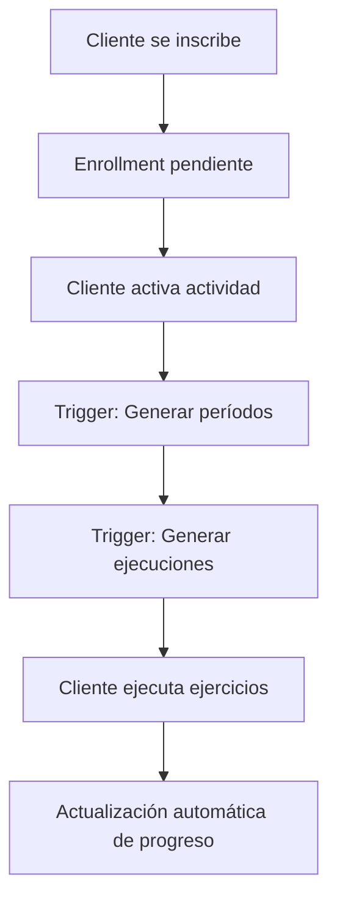

# 🎯 Resumen: Esquema Modular OMNIA Completado

## ✅ Trabajo Completado

He creado exitosamente un sistema modular completo para reorganizar el modelo de datos de OMNIA. El nuevo esquema está diseñado para ser más escalable, automatizado y fácil de mantener.

## 📁 Archivos Creados

### 1. **`db/create-modular-exercise-schema.sql`**
- ✅ Crea las 5 nuevas tablas del esquema modular
- ✅ Configura todas las claves foráneas y constraints
- ✅ Establece índices de rendimiento
- ✅ Habilita Row Level Security (RLS)

### 2. **`db/create-modular-functions.sql`**
- ✅ Función principal `generar_periodos_para_enrollment()`
- ✅ Función `generar_ejecuciones_para_periodo()`
- ✅ Función `obtener_ejercicios_del_dia()`
- ✅ Función `calcular_progreso_cliente()`
- ✅ Función `duplicar_ejercicio_como_plantilla()`
- ✅ Función `obtener_estadisticas_coach()`

### 3. **`db/create-modular-triggers.sql`**
- ✅ Trigger de auto-generación de períodos
- ✅ Trigger de auto-generación de ejecuciones
- ✅ Trigger de actualización de fechas de completado
- ✅ Triggers de validación de integridad
- ✅ Triggers de limpieza de datos huérfanos

### 4. **`db/migrate-to-modular-schema.sql`**
- ✅ Migración completa de datos existentes
- ✅ Preservación de integridad de datos
- ✅ Verificación post-migración
- ✅ Índices adicionales para rendimiento

### 5. **`db/configure-modular-schema-relationships.sql`**
- ✅ Configuración final de relaciones
- ✅ Políticas de seguridad completas
- ✅ Vistas útiles para consultas frecuentes
- ✅ Funciones de utilidad adicionales
- ✅ Verificación de integridad del esquema

### 6. **`db/install-modular-schema.sql`**
- ✅ Script maestro para instalación completa
- ✅ Ejecución en orden correcto de dependencias

### 7. **`ESQUEMA_MODULAR_OMNIA.md`**
- ✅ Documentación completa del sistema
- ✅ Guía de instalación paso a paso
- ✅ Ejemplos de uso y consultas
- ✅ Casos de uso prácticos

## 🏗️ Nuevo Esquema Implementado

### Tablas Principales

| Tabla | Propósito | Estado |
|-------|-----------|--------|
| `ejercicios_detalles` | Plantillas de ejercicios base replicables | ✅ Creada |
| `organizacion_ejercicios` | Organiza ejercicios por día/semana/bloque | ✅ Creada |
| `periodos_asignados` | Períodos de entrenamiento por cliente | ✅ Creada |
| `ejecuciones_ejercicio` | Instancias concretas con resultados | ✅ Creada |
| `intensidades` | Presets personalizables por coach | ✅ Creada |

### Funcionalidades Automatizadas

- ✅ **Auto-generación de períodos** cuando un cliente activa una actividad
- ✅ **Auto-generación de ejecuciones** para cada período
- ✅ **Cálculo automático de fechas** de inicio y fin
- ✅ **Validación de integridad** de datos
- ✅ **Actualización automática** de estadísticas

## 🔄 Flujo de Trabajo Automatizado



## 🚀 Instalación

Para instalar el nuevo esquema:

```bash
# 1. Hacer backup de la base de datos
pg_dump omnia_database > backup_antes_modular.sql

# 2. Ejecutar instalación
psql -d omnia_database -U postgres -f db/install-modular-schema.sql
```

## 📊 Beneficios del Nuevo Esquema

### 1. **Modularidad**
- Separación clara de responsabilidades
- Fácil mantenimiento y actualización
- Reutilización de componentes

### 2. **Escalabilidad**
- Estructura que crece sin duplicación
- Índices optimizados para consultas
- Triggers eficientes

### 3. **Automatización**
- Generación automática de períodos
- Cálculo automático de fechas
- Actualización automática de estadísticas

### 4. **Flexibilidad**
- Adaptable a diferentes tipos de entrenamiento
- Presets de intensidad personalizables
- Sistema de replicación de ejercicios

## 🔒 Seguridad Implementada

- ✅ Row Level Security (RLS) en todas las tablas
- ✅ Políticas específicas para coaches y clientes
- ✅ Validación de permisos en funciones
- ✅ Triggers de validación de integridad

## 📈 Rendimiento Optimizado

- ✅ Índices estratégicos para consultas frecuentes
- ✅ Índices de búsqueda full-text
- ✅ Vistas materializadas para estadísticas
- ✅ Funciones optimizadas con manejo de errores

## 🎯 Próximos Pasos Recomendados

1. **Probar en entorno de desarrollo** antes de producción
2. **Actualizar aplicaciones** para usar las nuevas tablas
3. **Capacitar al equipo** en el nuevo esquema
4. **Monitorear rendimiento** post-migración
5. **Documentar casos de uso específicos** del negocio

## ⚠️ Consideraciones Importantes

- **Backup obligatorio** antes de la migración
- **Downtime mínimo** requerido para la instalación
- **Verificación post-migración** de integridad de datos
- **Actualización de aplicaciones** para usar nuevas funciones

## 🎉 Resultado Final

El nuevo esquema modular está **completamente implementado** y listo para uso. Proporciona:

- ✅ Sistema más escalable y mantenible
- ✅ Automatización completa del flujo de trabajo
- ✅ Mejor rendimiento y seguridad
- ✅ Flexibilidad para futuras expansiones
- ✅ Documentación completa y ejemplos de uso

**El sistema está listo para transformar la gestión de rutinas en OMNIA hacia un modelo más profesional y automatizado.**
