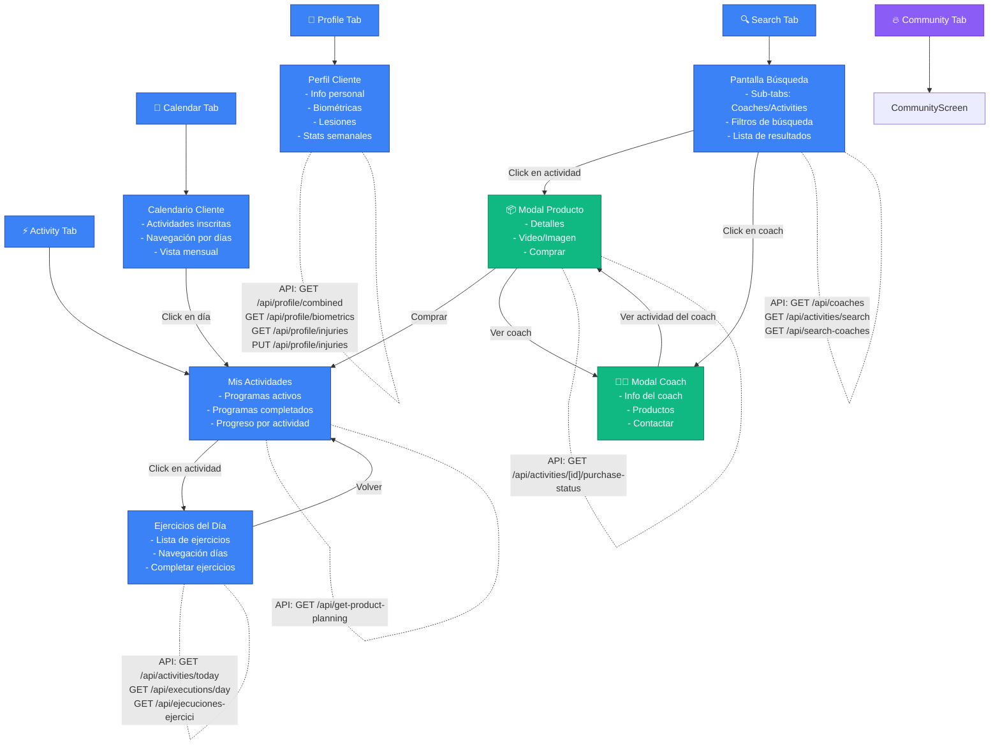
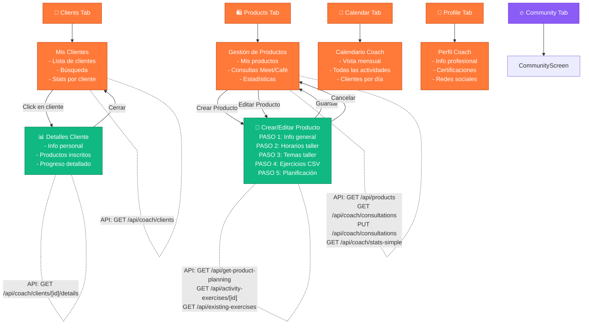
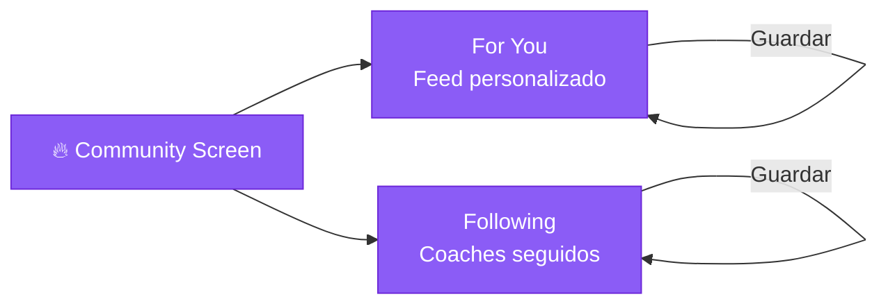
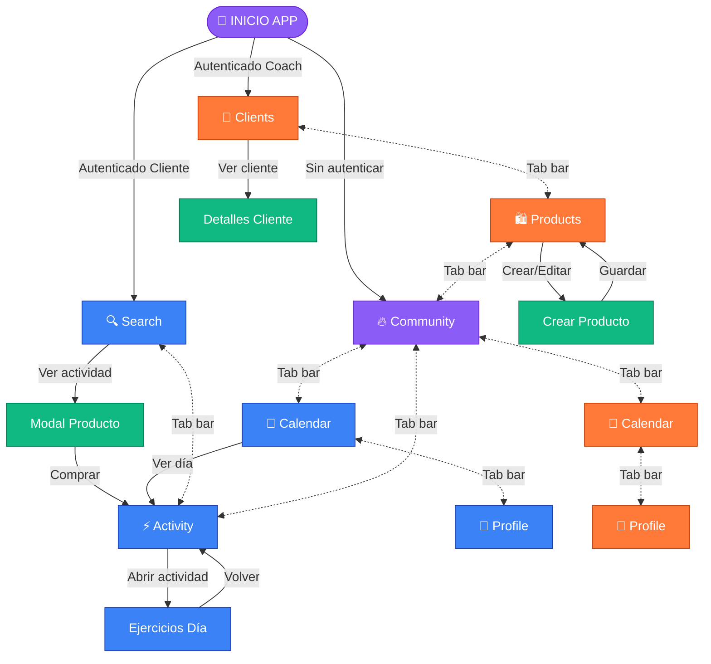

# 🗺️ MAPA DE FLUJO UX - OMNIA

## Diagrama Completo de Navegación y Flujos

### 📱 CLIENTE - Flujo Completo



---

### 👨‍💼 COACH - Flujo Completo



---

### 🔄 COMMUNITY SCREEN - Compartida



---

### 🎯 FLUJO COMPLETO INTEGRADO



---

## 📊 RESUMEN DE PANTALLAS POR ROL

### 👤 CLIENTE (8 pantallas principales)
1. **SearchScreen** - Búsqueda de coaches y actividades
2. **ActivityScreen** - Mis actividades inscritas
3. **CommunityScreen** - Feed social (compartida)
4. **CalendarScreen** - Mi calendario personal
5. **ProfileScreen** - Mi perfil y estadísticas
6. **TodayScreen** - Ejercicios del día
7. **ClientProductModal** - Detalles de producto
8. **CoachProfileModal** - Perfil del coach

### 👨‍💼 COACH (7 pantallas principales)
1. **ClientsScreen** - Gestión de clientes
2. **ProductsManagementScreen** - Gestión de productos
3. **CommunityScreen** - Feed social (compartida)
4. **CalendarScreen** - Calendario mensual
5. **ProfileScreen** - Perfil profesional
6. **CreateProductModal** - Crear/editar productos (5 pasos)
7. **ClientDetailsModal** - Detalles del cliente

---

## 🔗 TABLA DE CONEXIONES

| Desde | Acción | Hacia | Rol | Tipo |
|-------|--------|-------|-----|------|
| SearchScreen | Click actividad | ClientProductModal | Cliente | Modal |
| SearchScreen | Click coach | CoachProfileModal | Cliente | Modal |
| ClientProductModal | Comprar | ActivityScreen | Cliente | Navigate |
| ActivityScreen | Click actividad | TodayScreen | Cliente | Navigate |
| TodayScreen | Volver | ActivityScreen | Cliente | Navigate |
| CalendarScreen | Click día | ActivityScreen | Cliente | Navigate |
| ClientsScreen | Click cliente | ClientDetailsModal | Coach | Modal |
| ProductsScreen | Crear producto | CreateProductModal | Coach | Modal |
| CreateProductModal | Guardar | ProductsScreen | Coach | Navigate |
| ProfileScreen | Editar lesión | ProfileScreen | Ambos | Update |

---

## 📥 CÓMO USAR EN FIGMA

### Opción 1: Plugin Autoflow
1. Abre Figma
2. Busca plugin "Autoflow"
3. Pega el código Mermaid de arriba
4. Genera el diagrama automáticamente

### Opción 2: Manual
1. Crea frames para cada pantalla (390x844px - iOS)
2. Usa colores:
   - Cliente: #3B82F6 (azul)
   - Coach: #FF7939 (naranja)
   - Compartido: #8B5CF6 (púrpura)
3. En modo Prototype, conecta con flechas según la tabla de conexiones
4. Agrupa por roles usando frames containers

### Opción 3: FigJam
1. Abre FigJam
2. Importa como diagrama de flujo
3. El JSON se puede pegar directamente

---

## 🎨 VISUALIZACIÓN RECOMENDADA

```
┌─────────────────────────────────────────────────────────┐
│                    🏠 INICIO APP                         │
├─────────────────────────────────────────────────────────┤
│                                                          │
│  Sin Auth → Community                                   │
│  Cliente  → Search (explorar)                           │
│  Coach    → Clients (gestión)                           │
│                                                          │
└─────────────────────────────────────────────────────────┘
                        │
        ┌───────────────┴────────────────┐
        ▼                                ▼
┌──────────────┐              ┌──────────────┐
│   CLIENTE    │              │    COACH     │
│   (5 tabs)   │              │   (5 tabs)   │
└──────────────┘              └──────────────┘
        │                                │
        ├─ 🔍 Search                     ├─ 👥 Clients
        ├─ ⚡ Activity                   ├─ 🛍️ Products
        ├─ 🔥 Community (shared) ────────┤─ 🔥 Community
        ├─ 📅 Calendar                   ├─ 📅 Calendar
        └─ 👤 Profile                    └─ 👤 Profile
```

---

## 🔍 DETALLES POR PANTALLA

### SearchScreen (Cliente)
**Sub-tabs internos:**
- Coaches (lista de coaches)
- Activities (lista de actividades)

**Acciones disponibles:**
1. Click en Coach → Abre CoachProfileModal
2. Click en Actividad → Abre ClientProductModal
3. Aplicar filtros → Actualiza lista
4. Buscar por texto → Filtra resultados

**APIs usadas:**
- `GET /api/coaches`
- `GET /api/activities/search`
- `GET /api/search-coaches`

### ClientProductModal (Cliente)
**Secciones:**
- Header con coach info
- Video o imagen del producto
- Descripción y detalles
- Estadísticas (semanas, sesiones, ejercicios)
- Botón de compra/acceso

**Acciones:**
1. Comprar → Inscribe y va a ActivityScreen
2. Ver coach → Abre CoachProfileModal
3. Cerrar → Vuelve a SearchScreen

**APIs usadas:**
- `GET /api/activities/[id]/purchase-status`
- `GET /api/get-product-planning`

### ActivityScreen (Cliente)
**Secciones:**
- Programas activos
- Programas completados
- Progreso por actividad

**Acciones:**
1. Click en actividad → Navega a TodayScreen
2. Ver estadísticas → Muestra stats

**APIs usadas:**
- `GET /api/get-product-planning`

### TodayScreen (Cliente)
**Secciones:**
- Lista de ejercicios del día
- Navegación anterior/siguiente día
- Indicador de progreso

**Acciones:**
1. Completar ejercicio → Marca como done
2. Día anterior/siguiente → Cambia de día
3. Volver → Regresa a ActivityScreen

**APIs usadas:**
- `GET /api/activities/[id]/first-day`
- `GET /api/activities/today`
- `GET /api/executions/day`
- `GET /api/ejecuciones-ejercicio`

### ProfileScreen (Cliente)
**Secciones:**
- Avatar y datos personales
- Biométricas (peso, altura)
- Lesiones activas
- Estadísticas semanales (anillos de actividad)

**Acciones:**
1. Subir avatar → Actualiza foto
2. Editar biométricas → Actualiza datos
3. Agregar lesión → Abre modal
4. Eliminar lesión → Borra lesión

**APIs usadas:**
- `GET /api/profile/combined`
- `GET /api/profile/biometrics`
- `GET /api/profile/injuries`
- `PUT /api/profile/injuries`
- `GET /api/profile/exercise-progress`

### ClientsScreen (Coach)
**Secciones:**
- Lista de clientes
- Buscador de clientes
- Stats por cliente

**Acciones:**
1. Click en cliente → Abre ClientDetailsModal
2. Buscar cliente → Filtra lista

**APIs usadas:**
- `GET /api/coach/clients`

### ClientDetailsModal (Coach)
**Secciones:**
- Info del cliente (nombre, email, avatar)
- Productos inscritos
- Progreso en cada producto

**Acciones:**
1. Cerrar → Vuelve a ClientsScreen

**APIs usadas:**
- `GET /api/coach/clients/[id]/details`

### ProductsManagementScreen (Coach)
**Secciones:**
- Mis Productos (lista)
- Consultas (Meet 30min, Meet 1hr, Café)
- Estadísticas globales

**Acciones:**
1. Crear producto → Abre CreateProductModal
2. Editar producto → Abre CreateProductModal (modo edición)
3. Toggle consulta → Habilita/deshabilita
4. Actualizar precio consulta → Actualiza backend

**APIs usadas:**
- `GET /api/products`
- `GET /api/coach/consultations`
- `PUT /api/coach/consultations`
- `GET /api/coach/stats-simple`

### CreateProductModal (Coach)
**Pasos (wizard):**
1. **Paso 1**: Info general (título, descripción, categoría, tipo, precio, stock, imagen/video)
2. **Paso 2**: Horarios (solo talleres - fechas y horarios)
3. **Paso 3**: Temas (solo talleres - contenido del taller)
4. **Paso 4**: Ejercicios (CSV de ejercicios + videos)
5. **Paso 5**: Planificación semanal (períodos, sesiones, ejercicios por día)

**Acciones:**
1. Siguiente → Avanza al siguiente paso
2. Anterior → Regresa al paso anterior
3. Guardar → Crea/actualiza producto
4. Cancelar → Descarta cambios y cierra

**APIs usadas:**
- `GET /api/get-product-planning`
- `GET /api/activity-exercises/[id]`
- `GET /api/existing-exercises`

### CalendarScreen (Ambos roles)
**Cliente:**
- Muestra actividades inscritas
- Click en día → va a ActivityScreen

**Coach:**
- Vista mensual de todas las actividades
- Muestra clientes por día
- Estadísticas mensuales

**APIs usadas:**
- (Usa datos locales de enrollments)

---

## 🎨 CÓDIGO DE COLORES PARA FIGMA

```css
/* Roles */
--cliente: #3B82F6 (azul)
--coach: #FF7939 (naranja OMNIA)
--shared: #8B5CF6 (púrpura)

/* Tipos de elementos */
--screen: Fill principal del rol
--modal: #10B981 (verde)
--action: #F59E0B (amarillo/amber)
--api: #6B7280 (gris - para anotaciones)

/* Backgrounds */
--app-bg: #000000 (negro)
--card-bg: #1E1E1E (gris oscuro)
```

---

## 📐 DIMENSIONES RECOMENDADAS PARA FIGMA

- **Frame principal**: 390 x 844 px (iPhone 14)
- **Modales**: 370 x auto (con padding 10px)
- **Spacing entre frames**: 100px horizontal, 150px vertical
- **Flechas de conexión**: 2px grosor
- **Tipografía**: 
  - Títulos: 16px Bold
  - Subtítulos: 14px Medium
  - Cuerpo: 12px Regular

---

## 🚀 EXPORTAR A OTRAS HERRAMIENTAS

### Miro
1. Copia el código Mermaid de arriba
2. En Miro, usa "Apps" → "Mermaid Chart"
3. Pega el código

### Draw.io / Diagrams.net
1. Importa el archivo JSON
2. O usa el código Mermaid con plugin

### Lucidchart
1. Importa desde Mermaid
2. Ajusta estilos según colores de arriba

---

**Fecha de generación**: 2025-01-09
**Basado en**: Análisis exhaustivo de código real post-optimización
