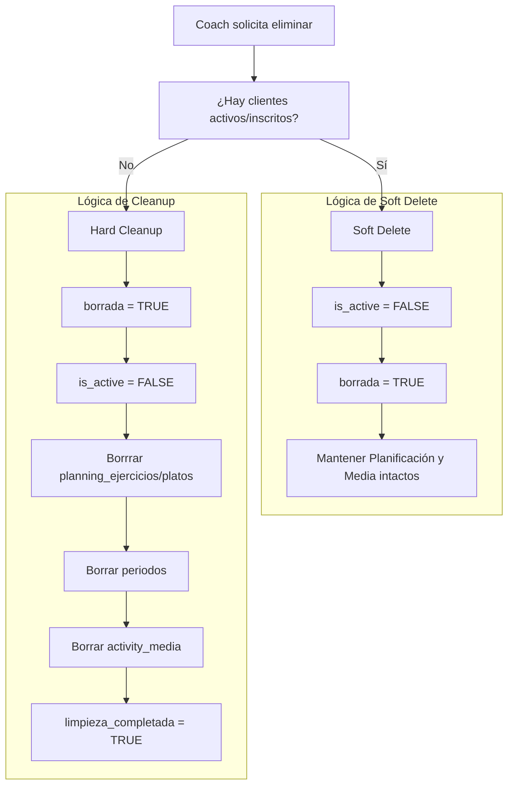

# Ciclo de Vida de Actividades y Soft Delete

Este documento describe el flujo de creación, gestión y eliminación de actividades de Fitness y Nutrición en Omnia, incluyendo la lógica de protección de datos para clientes activos.

## 1. Flujo de Creación de Actividades

La creación de actividades (Programas, Talleres o Doc) sigue un proceso estructurado para garantizar la integridad de la base de datos desnormalizada.

### A. Definición Básica
Se inserta en la tabla `activities` los metadatos principales:
- `title`, `description`, `type`, `price`, `coach_id`.
- `categoria` (fitness/nutricion).
- `adaptive_rule_ids` (reglas del motor adaptativo).

### B. Carga de Planificación (Fitness/Nutri)
Se utiliza el sistema de Bulk Upload (`/api/activities/exercises/bulk` o `/api/activity-nutrition/bulk`):
1. **Librería de Ítems**: Se pueblan `ejercicios_detalles` o `nutrition_program_details`.
2. **Calendario del Coach**: Se crean las filas en `planificacion_ejercicios` o `planificacion_platos` vinculando los días y semanas con los ítems de la librería.

---

## 2. Flujo de Eliminación Protegida (Soft Delete)

Eliminar una actividad en Omnia no es una operación destructiva inmediata si existen clientes que ya la han adquirido. Queremos mantener su experiencia intacta mientras el coach "limpia" su catálogo.

### Algoritmo de Eliminación (`/api/delete-activity-final`)



### Estados de la Actividad
- **`is_active = FALSE`**: El producto desaparece del Marketplace/Buscador.
- **`borrada = TRUE`**: Indica que el coach ha confirmado la intención de eliminarla definitivamente.
- **`limpieza_completada = TRUE`**: Los datos pesados de planificación han sido removidos (esto ocurre automáticamente cuando el último cliente termina o si no había clientes).

---

## 3. Tablas e Impacto Técnico

| Tabla | Comportamiento en Deletion | Razón |
| :--- | :--- | :--- |
| `activities` | **Se mantiene** | Historial de ventas y métricas del coach. |
| `activity_enrollments`| **Se mantiene** | Contratos de compra del cliente. |
| `progreso_cliente` | **Se mantiene** | El cliente debe poder terminar su programa. |
| `planificacion_*` | Borrado post-clean | Solo se borra cuando no hay enrollments activos. |
| `activity_media` | Borrado post-clean | Ahorro de espacio una vez que nadie la usa. |

## 4. Preservación de Estadísticas Desnormalizadas

Al realizar un **Hard Cleanup**, se eliminan las filas de `planificacion_ejercicios` y `planificacion_platos`. Para evitar que el "Archivo Muerto" pierda la información técnica de la actividad, el sistema aplica una técnica de **Persistence Freeze**:

1. **Captura previa**: Antes de ejecutar el `DELETE` en las tablas de planificación, se consultan los valores actuales de `items_totales`, `items_unicos` y `sesiones_dias_totales` en la tabla `activities`.
2. **Congelación**: Estos valores se re-escriben en la fila de `activities` durante el mismo proceso de limpieza.
3. **Resultado**: El coach puede ver en su Archivo Muerto cuántos ejercicios tenía un programa o cuántas sesiones duraba, incluso si los datos subyacentes ya no existen en DB para optimizar almacenamiento.

---

## 5. Scripts y Consultas Útiles

### Detectar Actividades Huérfanas para Cleanup
```sql
SELECT a.id, a.title 
FROM activities a
WHERE a.borrada = TRUE 
  AND a.limpieza_completada = FALSE
  AND NOT EXISTS (
    SELECT 1 FROM activity_enrollments e 
    WHERE e.activity_id = a.id 
      AND e.status IN ('active', 'enrolled')
  );
```

### Ejecutar Cleanup Manual (Refuerzo)
Al ejecutar el cleanup, marcamos `limpieza_completada` para no re-procesar.
