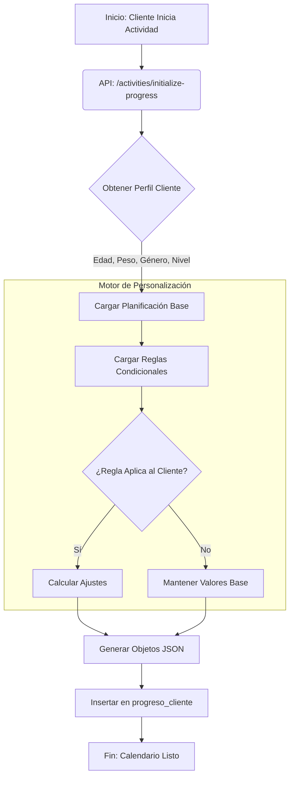

# Generación de Progreso del Cliente (Progreso Cliente Generation)

Este documento detalla la arquitectura y el flujo técnico de cómo **Omnia** transforma un "Producto" (definición abstracta) en el "Progreso del Cliente" (instancia concreta y personalizada) cuando un usuario inicia una actividad.

## 1. El Modelo de Datos

La arquitectura se basa en separar la **Definición** (Coach) de la **Instancia** (Cliente).

### A. Definición (Lado del Coach)
1.  **`activities`**: La entidad padre (ej. "Hipertrofia 12 Semanas").
2.  **Detalles del Contenido**:
    *   **Fitness**: `ejercicios_detalles` (Librería de ejercicios: Press Banca, Sentadillas, video, músculos).
    *   **Nutrición**: `nutrition_program_details` (Librería de platos: Recetas, macros, ingredientes).
3.  **Planificación (El Calendario)**:
    *   **`planificacion_ejercicios`** (y `planificacion_platos`): Define **QUÉ** se hace **CUÁNDO**.
    *   Estructura: `semana`, `dia`, `bloque`, `orden`.
    *   Contenido: JSON que referencia IDs de la librería (`{ id: 101, reps: 10, series: 4 }`).
4.  **Reglas Condicionales (Personalización)**:
    *   **`product_conditional_rules`**: Lógica de adaptación.
    *   Ejemplo: "Si es Mujer y tiene < 25 años -> Aumentar repeticiones 10%, reducir peso 5%".

### B. Instancia (Lado del Cliente)
1.  **`activity_enrollments`**: Vincula al Cliente con la Actividad y define la fecha de inicio (`start_date`).
2.  **`progreso_cliente`**: La "Biblia diaria" del cliente.
    *   Es una copia **desnormalizada** y **expandida** de la planificación.
    *   Contiene TODO lo necesario para renderizar el día sin consultar las tablas originales (snapshot).
    *   Permite que el cliente edite sus propios pesos/reps sin afectar el plan original.

---

## 2. El Proceso de "Instanciación" (`initialize-progress`)

Cuando un cliente hace clic en "Comenzar Programa", se dispara el proceso `initialize-progress`. Este es el **Factory Method** del sistema.

### Flujo de Datos

### Paso a Paso Técnico

1.  **Lectura de la Planificación**:
    *   El sistema lee `planificacion_ejercicios` para la actividad.
    *   Calcula todas las fechas reales basadas en el `start_date` del enrollment.
    *   Calcula los ciclos (períodos) si la actividad es cíclica.

2.  **Lectura de Componentes Base**:
    *   Obtiene los detalles crudos de `ejercicios_detalles` o `nutrition_program_details` (Videos, nombres, descripciones).

3.  **Aplicación de Reglas Condicionales (Personalization Engine)**:
    *   **Input**: Perfil del usuario (Clients Table) + Reglas del Producto.
    *   **Matching**: Evalúa si el cliente cumple las condiciones (ej. `genero === 'female'`, `20 <= edad <= 30`).
    *   **Ajustes**: Si hay match, modifica los valores base:
        *   **Fitness**: `reps`, `peso`, `series`, `duracion_min`.
        *   **Nutrición**: `porciones` (escalado de macros), `ingredientes` (sustituciones).
    *   *Nota: Si faltan datos en el perfil, se usan los valores base.*

4.  **Generación de Snapshots (`progreso_cliente`)**:
    *   Se crea un registro por cada día activo.
    *   **`ejercicios_pendientes`**: Array JSON con la lista de tareas del día.
    *   **`detalles_series`**: Copia congelada de la info técnica (reps, series ajustadas).
    *   **`minutos_json` / `calorias_json`**: Valores calculados y ajustados.

---

## 3. Estructura de `progreso_cliente`

Cada fila representa un día en la vida del programa del cliente.

| Columna | Descripción | Fuente Original (Transformada) |
| :--- | :--- | :--- |
| `fecha` | Fecha calendario real (ej. 2024-05-20) | `start_date` + `planificacion.semana/dia` |
| `ejercicios_pendientes` | IDs y orden de lo que toca hacer hoy | `planificacion_ejercicios` |
| `detalles_series` | JSON con la prescripción técnica (reps, kg) | `ejercicios_detalles` + **Reglas Condicionales** |
| `ejercicios_completados`| Estado de completitud (check del usuario) | (Input del Usuario) |

## 4. Importancia de la "Oportunidad Perdida"

Si el cliente **no completa su perfil** (peso, edad, género) antes de iniciar:
1.  El motor de reglas no puede hacer match.
2.  Se instancian los valores "default" (genéricos).
3.  **Consecuencia**: El cliente recibe un plan estándar, perdiendo la personalización diseñada por el coach.
4.  **Solución**: El frontend advierte al usuario si faltan datos críticos antes de llamar a `initialize-progress`.
