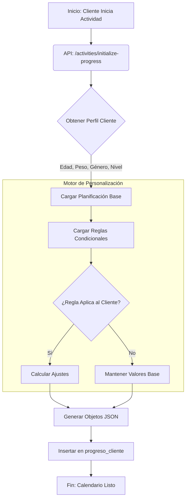

# Generación de Progreso del Cliente (Progreso Cliente Generation)

Este documento detalla la arquitectura y el flujo técnico de cómo **Omnia** transforma un "Producto" (definición abstracta) en el "Progreso del Cliente" (instancia concreta y personalizada) cuando un usuario inicia una actividad.

## 1. El Modelo de Datos

La arquitectura se basa en separar la **Definición** (Coach) de la **Instancia** (Cliente).

### A. Definición (Lado del Coach)
1.  **`activities`**: La entidad padre (ej. "Hipertrofia 12 Semanas").
2.  **Detalles del Contenido**:
    *   **Fitness**: `ejercicios_detalles` (Librería de ejercicios: Press Banca, Sentadillas, video, músculos).
    *   **Nutrición**: `nutrition_program_details` (Librería de platos: Recetas, macros, ingredientes).
3.  **Planificación (El Calendario)**:
    *   **`planificacion_ejercicios`** (y `planificacion_platos`): Define **QUÉ** se hace **CUÁNDO**.
    *   Estructura: `semana`, `dia`, `bloque`, `orden`.
    *   Contenido: JSON que referencia IDs de la librería (`{ id: 101, reps: 10, series: 4 }`).
4.  **Configuración Adaptativa (Motor OMNIA v3.0)**:
    *   **`activities.adaptive_rule_ids`**: Almacena un ARRAY de IDs de reglas activadas por el coach desde el `adaptive_rules_catalog`.
    *   Lógica: El Motor Adaptativo (`lib/omnia-adaptive-motor.ts`) cruza estos IDs con el perfil del cliente para aplicar multiplicadores de Kcal, Proteínas, Series/Reps, etc.

### B. Instancia (Lado del Cliente)
1.  **`activity_enrollments`**: Vincula al Cliente con la Actividad y define la fecha de inicio (`start_date`).
2.  **`progreso_cliente`**: La "Biblia diaria" del cliente.
    *   Es una copia **desnormalizada** y **expandida** de la planificación.
    *   Contiene TODO lo necesario para renderizar el día sin consultar las tablas originales (snapshot).
    *   Permite que el cliente edite sus propios pesos/reps sin afectar el plan original.

---

## 2. El Proceso de "Instanciación" (`initialize-progress`)

Cuando un cliente hace clic en "Comenzar Programa", se dispara el proceso `initialize-progress`. Este es el **Factory Method** del sistema.

### Flujo de Datos


```mermaid
graph TD
    A[Inicio: Cliente Inicia Actividad] --> B(API: /activities/initialize-progress)
    B --> C{Obtener Perfil Cliente}
    C -->|Edad, Peso, Género, Nivel| D[Cargar Planificación Base]
    
    subgraph "Motor de Personalización"
    D --> E[Cargar Reglas Condicionales]
    E --> F{¿Regla Aplica al Cliente?}
    F -->|Sí| G[Calcular Ajustes]
    F -->|No| H[Mantener Valores Base]
    end
    
    G --> I[Generar Objetos JSON]
    H --> I
    
    I --> J[Insertar en progreso_cliente]
    J --> K[Fin: Calendario Listo]
```

### Paso a Paso Técnico

1.  **Lectura de la Planificación**:
    *   El sistema lee `planificacion_ejercicios` para la actividad.
    *   Calcula todas las fechas reales basadas en el `start_date` del enrollment.
    *   Calcula los ciclos (períodos) si la actividad es cíclica.

2.  **Lectura de Componentes Base**:
    *   Obtiene los detalles crudos de `ejercicios_detalles` o `nutrition_program_details` (Videos, nombres, descripciones).

3.  **Aplicación de Reglas Condicionales (Personalization Engine)**:
    *   **Input**: Perfil del usuario (Clients Table) + Reglas del Producto.
    *   **Matching**: Evalúa si el cliente cumple las condiciones (ej. `genero === 'female'`, `20 <= edad <= 30`).
    *   **Ajustes**: Si hay match, modifica los valores base:
        *   **Fitness**: `reps`, `peso`, `series`, `duracion_min`.
        *   **Nutrición**: `porciones` (escalado de macros), `ingredientes` (sustituciones).
    *   *Nota: Si faltan datos en el perfil, se usan los valores base.*

4.  **Generación de Snapshots (`progreso_cliente`)**:
    *   Se crea un registro por cada día activo.
    *   **`ejercicios_pendientes`**: Array JSON con la lista de tareas del día.
    *   **`detalles_series`**: Copia congelada de la info técnica (reps, series ajustadas).
    *   **`minutos_json` / `calorias_json`**: Valores calculados y ajustados.

---

## 3. Estructura de `progreso_cliente`

Cada fila representa un día en la vida del programa del cliente.

| Columna | Descripción | Fuente Original (Transformada) |
| :--- | :--- | :--- |
| `fecha` | Fecha calendario real (ej. 2024-05-20) | `start_date` + `planificacion.semana/dia` |
| `ejercicios_pendientes` | IDs y orden de lo que toca hacer hoy | `planificacion_ejercicios` |
| `detalles_series` | JSON con la prescripción técnica (reps, kg) | `ejercicios_detalles` + **Reglas Condicionales** |
| `ejercicios_completados`| Estado de completitud (check del usuario) | (Input del Usuario) |

## 4. Importancia de la "Oportunidad Perdida"

Si el cliente **no completa su perfil** (peso, edad, género) antes de iniciar:
1.  El motor de reglas no puede hacer match.
2.  Se instancian los valores "default" (genéricos).
3.  **Consecuencia**: El cliente recibe un plan estándar, perdiendo la personalización diseñada por el coach.
4.  **Solución**: El frontend advierte al usuario si faltan datos críticos antes de llamar a `initialize-progress`.

---

## 5. Consultas de Auditoría (Queries de Verificación)

Para validar que el motor está "mordiendo" correctamente los datos, usamos esta query de simulación que reproduce el algoritmo de instanciación:

### Simulación de Generación de Progreso (Nutrición)
Esta query cruza la planificación del coach con el perfil de un cliente real y aplica las reglas acumulativas del catálogo.

```sql
WITH config AS (
    SELECT 
        93 as target_activity_id,
        '00dedc23-0b17-4e50-b84e-b2e8100dc93c'::uuid as target_client_id,
        '2024-05-20'::date as start_date,
        ARRAY[35, 62, 77, 50]::int[] as active_rule_ids -- Reglas del perfil del cliente
),
motor_calculo AS (
    SELECT 
        exp(sum(ln(NULLIF(r.kcal, 0)))) as factor_kcal,
        exp(sum(ln(NULLIF(r.proteina, 0)))) as factor_prot
    FROM public.adaptive_rules_catalog r
    WHERE r.id IN (SELECT unnest(adaptive_rule_ids) FROM public.activities WHERE id = (SELECT target_activity_id FROM config))
      AND r.id IN (SELECT unnest(active_rule_ids) FROM config)
),
planning_meta AS (
    SELECT MAX(p.numero_semana) as max_sems, per.cantidad_periodos
    FROM public.planificacion_ejercicios p
    CROSS JOIN public.periodos per 
    WHERE p.actividad_id = (SELECT target_activity_id FROM config)
      AND per.actividad_id = (SELECT target_activity_id FROM config)
    GROUP BY per.cantidad_periodos
),
calendario_completo AS (
    SELECT 
        (SELECT start_date FROM config) + (dia_offset * interval '1 day') as fecha,
        CASE MOD(dia_offset, 7)
            WHEN 0 THEN lunes WHEN 1 THEN martes WHEN 2 THEN miercoles 
            WHEN 3 THEN jueves WHEN 4 THEN viernes WHEN 5 THEN sabado ELSE domingo
        END as data_json
    FROM (SELECT generate_series(0, (max_sems * cantidad_periodos * 7) - 1) as dia_offset FROM planning_meta) d
    JOIN public.planificacion_ejercicios pu ON pu.actividad_id = (SELECT target_activity_id FROM config) 
      AND pu.numero_semana = (MOD(d.dia_offset / 7, (SELECT max_sems FROM planning_meta)) + 1)
)
SELECT 
    fecha,
    jsonb_object_agg((plato->>'id') || '_' || (plato->>'bloque') || '_' || (plato->>'orden'), (plato->>'id')) as pendientes,
    jsonb_object_agg((plato->>'id') || '_' || (plato->>'bloque') || '_' || (plato->>'orden'), 
        jsonb_build_object(
            'plato', det.nombre,
            'kcal', ROUND(det.calorias * COALESCE((SELECT factor_kcal FROM motor_calculo), 1), 0),
            'prot', ROUND(det.proteinas * COALESCE((SELECT factor_prot FROM motor_calculo), 1), 1)
        )
    ) as macros
FROM calendario_completo
CROSS JOIN LATERAL jsonb_array_elements(data_json->'ejercicios') plato
JOIN public.nutrition_program_details det ON det.id = (plato->>'id')::int
GROUP BY fecha ORDER BY fecha;
```

### Simulación de Generación de Progreso (Fitness)
Esta query valida el ajuste de Series, Repeticiones y Peso según el Perfil de Riesgo/Nivel del cliente.

```sql
WITH config AS (
    SELECT 
        100 as target_activity_id, -- Ej: Programa Hipertrofia
        ARRAY[84, 63, 27]::int[] as active_rule_ids -- Avanzado(84), Plenitud(63), Hombre(27)
),
motor_calculo AS (
    SELECT 
        exp(sum(ln(NULLIF(r.kg, 0)))) as factor_peso,
        exp(sum(ln(NULLIF(r.series, 0)))) as factor_series,
        exp(sum(ln(NULLIF(r.repetiiiciones, 0)))) as factor_reps
    FROM public.adaptive_rules_catalog r
    WHERE r.id IN (SELECT unnest(adaptive_rule_ids) FROM public.activities WHERE id = (SELECT target_activity_id FROM config))
      AND r.id IN (SELECT unnest(active_rule_ids) FROM config)
)
SELECT 
    det.nombre as ejercicio,
    (plato->>'series')::int as base_series,
    (plato->>'repeticiones')::int as base_reps,
    ROUND((plato->>'series')::int * COALESCE((SELECT factor_series FROM motor_calculo), 1)) as final_series,
    ROUND((plato->>'repeticiones')::int * COALESCE((SELECT factor_reps FROM motor_calculo), 1)) as final_reps
FROM public.planificacion_ejercicios p
CROSS JOIN LATERAL jsonb_array_elements(p.lunes->'ejercicios') plato
JOIN public.ejercicios_detalles det ON det.id = (plato->>'id')::int
WHERE p.actividad_id = (SELECT target_activity_id FROM config) AND p.numero_semana = 1;
```
